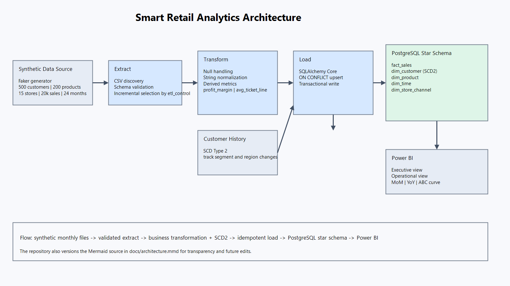
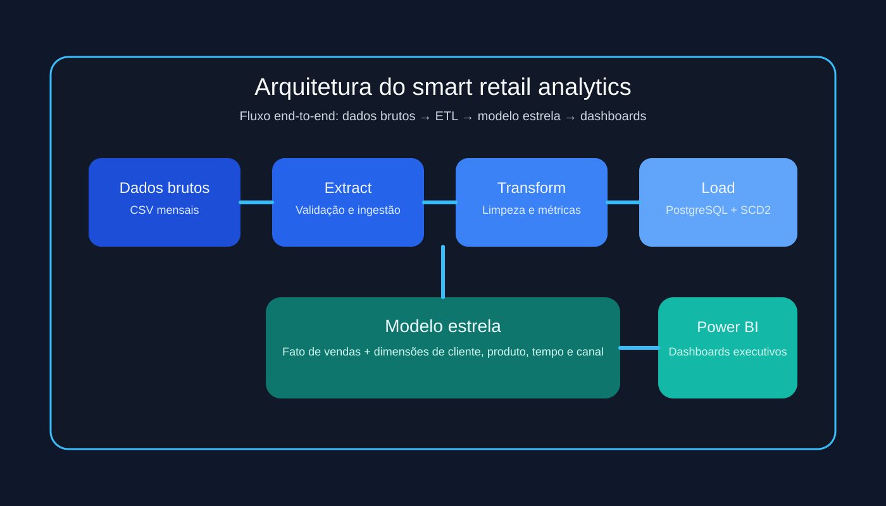
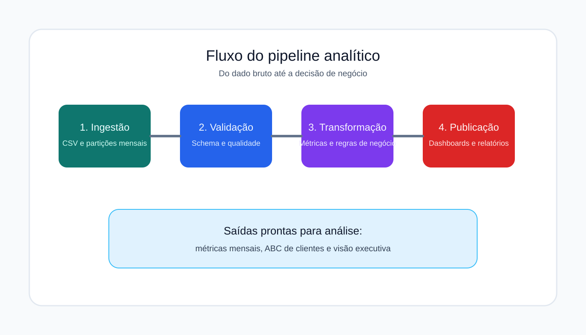
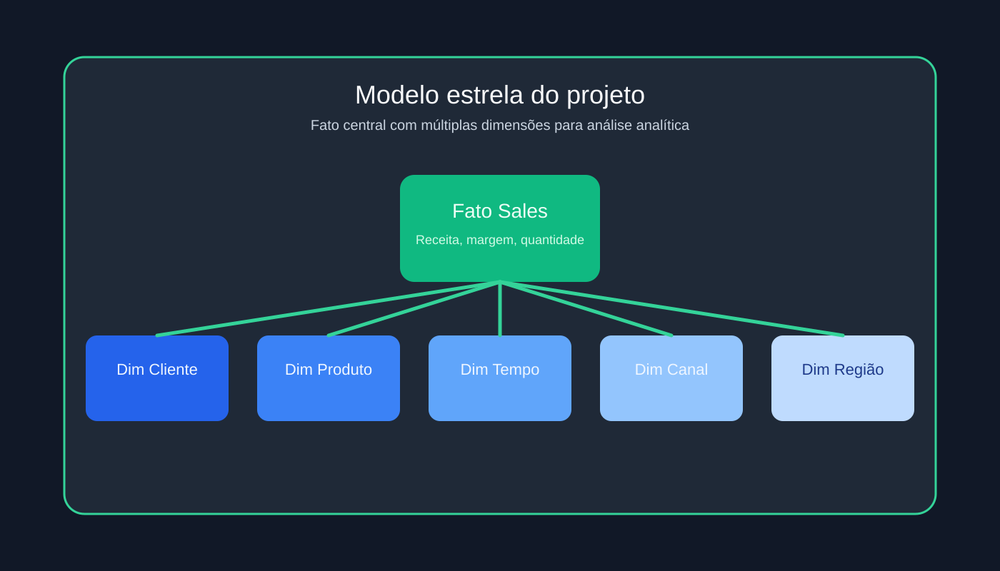
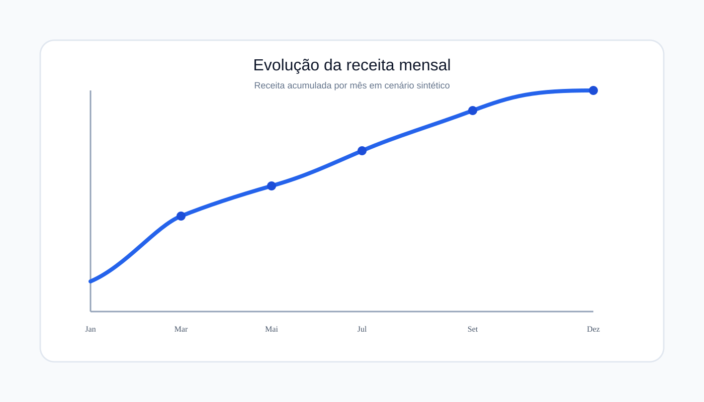
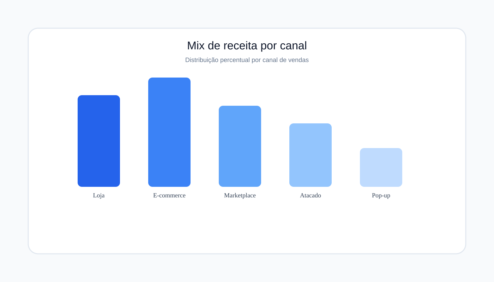
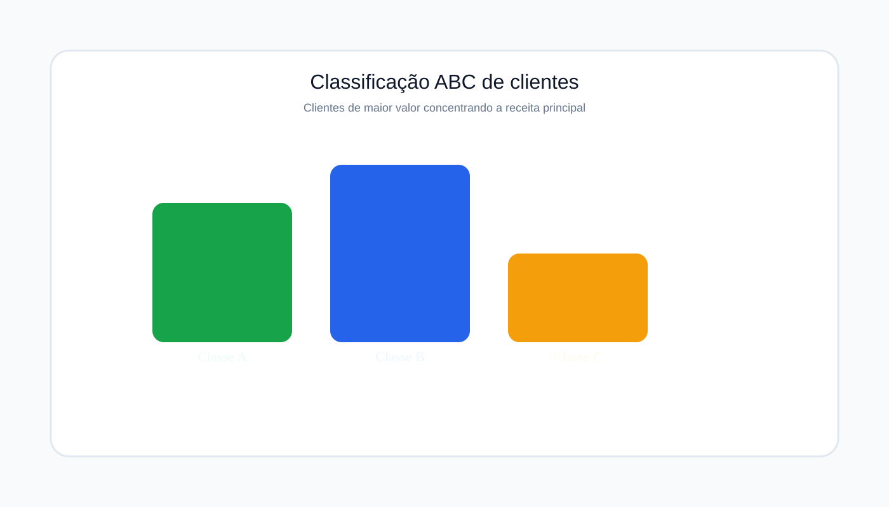
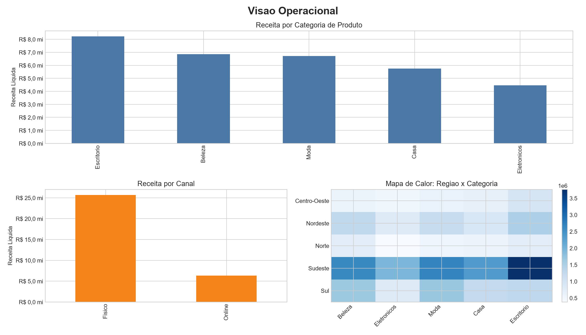
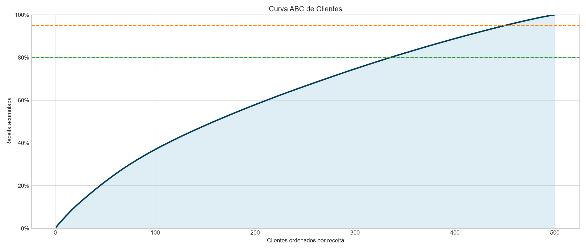
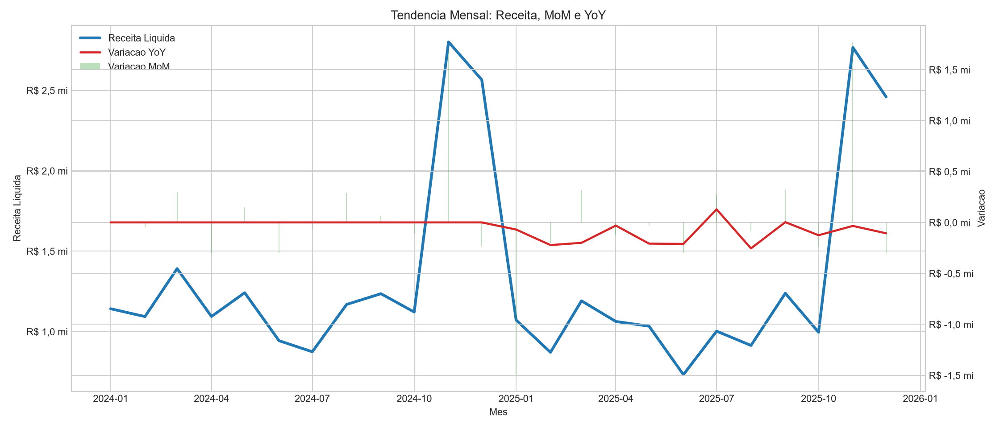

# Plataforma de Analytics para Varejo

Projeto de analytics para recrutadores de Dados: transforma vendas brutas em uma base analitica que ajuda times de varejo a decidir onde crescer receita, proteger margem e entender melhor a performance de clientes, produtos e canais.


[](https://github.com/RodrigoAp727/smart-retail-analytics/actions/workflows/ci.yml)
[](LICENSE)


## Perfil do projeto
Este repositorio apresenta uma solucao completa de analytics para varejo, com foco em engenharia de dados, modelagem analitica e storytelling visual. O resultado e uma base que pode ser usada para demonstrar capacidade tecnica em entrevistas, portifolio e processos seletivos.

### Competencias destacadas
- ETL/ELT com pipeline reproducivel
- Modelagem estrela e historico de clientes com SCD Tipo 2
- Qualidade de dados, testes e automacao
- Visualizacao analitica preparada para Power BI

### Resumo executivo
- Problema resolvido: transformar dados operacionais fragmentados em indicadores de negocio confiaveis para decisoes de receita, margem e clientes.
- Diferencial tecnico: pipeline com idempotencia, modelagem estrela, SCD Tipo 2 e validacao de schema para reduzir risco operacional.
- Evidencia pratica: dados sinteticos realistas, testes automatizados e visuais prontos para demonstrar maturidade em analytics engineering.

### O que este projeto demonstra
- Capacidade de construir uma esteira analitica end-to-end, desde ingestao ate entrega de dashboards.
- Disciplina para tratar qualidade de dados, regras de negocio e reprocessamento sem duplicacao de fatos.
- Boa comunicacao de resultado: o projeto e estruturado para ser apresentado tanto a recrutadores quanto a times de negocio.

### O problema
Times de negocio em varejo costumam receber dados operacionais fragmentados, mas nao uma visao confiavel de quais clientes sustentam a receita, quais categorias carregam margem e onde a performance esta desacelerando. Este projeto resolve esse gap com uma esteira analitica que entrega historico consistente, consultas rapidas e base pronta para Power BI.

### Arquitetura


Os dados sinteticos entram como CSVs mensais para simular ingestao incremental realista. A etapa de extract valida schema e identifica apenas particoes novas; a transform aplica padronizacao, regras de nulos e metricas derivadas; a load grava um modelo estrela em PostgreSQL com upsert idempotente e historico SCD Tipo 2 em clientes. O resultado final e uma base analitica adequada para dashboards executivos e operacionais no Power BI.

### Visao visual do projeto

<div align="center">
  
</div>

<div align="center">
  
</div>

<div align="center">
  
</div>

### Graficos ilustrativos

<div align="center">
  
</div>

<div align="center">
  
</div>

<div align="center">
  
</div>

### Decisoes tecnicas de destaque
- SCD Tipo 2 em `dim_customer` preserva historico de segmento e regiao, o que permite comparar performance sem perder contexto de mudancas cadastrais.
- Upsert idempotente com `ON CONFLICT` permite rerun, backfill e reprocessamento sem duplicar fatos, algo esperado em pipeline de dados confiavel.
- Modelo estrela foi escolhido em vez de estrutura normalizada porque simplifica leitura analitica e reduz custo de consulta para agregacoes por tempo, cliente, produto e canal.

### Diferenciais para avaliacao tecnica
- Dados sinteticos com seed fixa e sazonalidade controlada para demonstracao reprodutivel.
- Pipeline incremental com tabela de controle para rastrear particoes ja processadas.
- Camada de testes e lint para evidenciar disciplina de engenharia de dados.

### Como rodar em 3 comandos
```bash
cp .env.example .env
docker compose build
docker compose up pipeline
```

Para Windows nativo, use `./setup.ps1` no PowerShell. Para Unix-like, use `./setup.sh`.

### Como validar em 2 minutos
1. Rode `PowerShell -ExecutionPolicy Bypass -File .\setup_local.ps1`.
2. Abra `data/marts/run_summary.json` para ver o resumo da execucao.
3. Confira os visuais em `dashboard/screenshots/`.

### Modo sem Docker (contingencia para hoje)
Se sua maquina estiver sem virtualizacao/WSL e voce precisar apresentar o projeto hoje, rode:

```powershell
PowerShell -ExecutionPolicy Bypass -File .\setup_local.ps1
```

Esse modo executa geracao, extract e transform completos e grava saidas analiticas em:
- `data/processed/sales_transformed.csv`
- `data/marts/monthly_metrics.csv`
- `data/marts/customer_abc.csv`
- `data/marts/run_summary.json`

### Stack
- Python
- PostgreSQL
- Docker Compose
- pytest
- GitHub Actions
- Power BI

### Perfil profissional alvo
Projeto desenhado para evidenciar maturidade de Analista de Dados e Analista Financeiro: foco em decisoes de negocio, qualidade do dado, modelagem analitica e reprodutibilidade tecnica.

### Metadados recomendados no GitHub
- Description: Retail analytics pipeline that turns raw sales data into decision-ready metrics for revenue, margin, and customer performance.
- Topics: data-engineering, analytics, data-analytics, financial-analysis, etl, python, postgresql, docker, power-bi, star-schema, scd2, sqlalchemy, pytest, github-actions

### Screenshots do dashboard
Os PNGs finais ficam em `dashboard/screenshots/` com estes nomes:
- `executive-overview.png`
- `operational-overview.png`
- `customer-abc-analysis.png`
- `monthly-trends.png`

Enquanto os prints reais do Power BI nao estiverem exportados, use os previews gerados automaticamente e siga o guia em [dashboard/README.md](dashboard/README.md) e o checklist em [dashboard/screenshots/README.md](dashboard/screenshots/README.md).






### Resultados e metricas do pipeline
- 500 clientes sinteticos, 200 produtos e 15 lojas/canais gerados com seed fixa.
- 20.000 registros de vendas distribuidos em 24 particoes mensais para simular carga incremental.
- 5 testes automatizados no repositório: 3 unitarios executados localmente e 2 de integracao preparados para Postgres.
- Lint Python validado com `ruff check src tests`.
- Suite local validada com `pytest`: `3 passed, 2 skipped` no ambiente sem Postgres ativo.

### Proximos passos
1. Publicar o dashboard real em Power BI Service com refresh agendado.
2. Adicionar camada dbt para testes de qualidade de dados no warehouse.
3. Evoluir a orquestracao incremental para Airflow ou Prefect.

### Glossario PT ↔ EN
| PT | EN |
| --- | --- |
| cliente | customer |
| receita | revenue |
| carga | load |
| extracao | extract |
| transformacao | transform |
| desconto | discount |
| custo de envio | shipping cost |
| margem de lucro | profit margin |
| loja/canal | store/channel |

### Status de prontidao para portfolio
- Storytelling de negocio no topo do README.
- Diagrama de arquitetura e previews visuais versionados no repositório.
- Pipeline validado localmente com saidas analiticas concretas.
- Templates de issue/PR e guia de contribuicao prontos para trabalho colaborativo.

### Governanca profissional
- Codigo de conduta: `CODE_OF_CONDUCT.md`
- Politica de seguranca: `SECURITY.md`
- Guia de suporte: `SUPPORT.md`
- Atualizacao automatica de dependencias: `.github/dependabot.yml`

### Publicacao no GitHub
Use o roteiro final em `CHECKLIST_PUBLICACAO_GITHUB.md` para publicar com padrao profissional e sem risco de esquecer itens criticos.